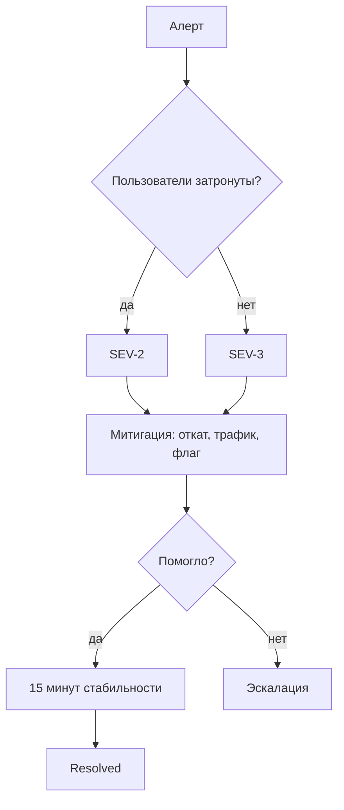
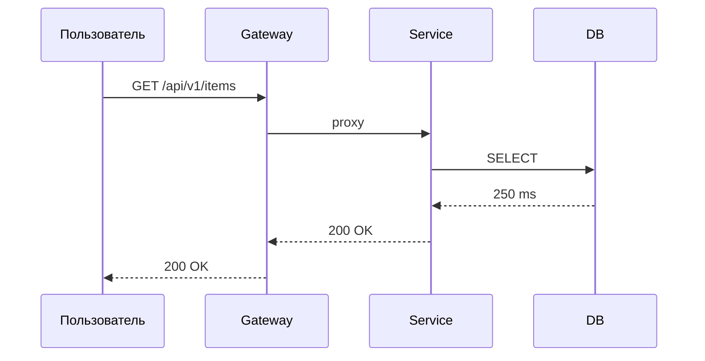
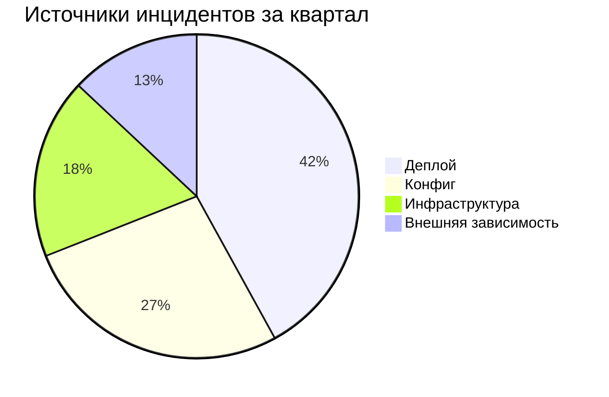

---
tags:
  - test/diagrams
type: surface
---

# Математика и схемы

## Блочные формулы

$$
\text{доступность} = \frac{\text{uptime}}{\text{uptime} + \text{downtime}}
$$

$$
B(t) = 1 - \frac{1}{1 - \text{SLO}} \cdot \frac{1}{T}\int_{0}^{t} e(\tau)\, d\tau
$$

$$
\begin{aligned}
p_{99} &\le 250\ \text{ms} \\
\text{error rate} &\le 0.5\ \% \\
\text{saturation} &\le 85\ \%
\end{aligned}
$$

## Mermaid

Схемы Obsidian рисует своим mermaid, конфиг темы туда не передать. Красится сгенерированный SVG по классам библиотеки — работает, но ломается при её обновлении.

## Изображение

Внешних картинок в тестовом хранилище нет намеренно: тема не должна зависеть от сети. Проверяется рамка и подпись у отсутствующего вложения.

![[несуществующая-картинка.png]]
